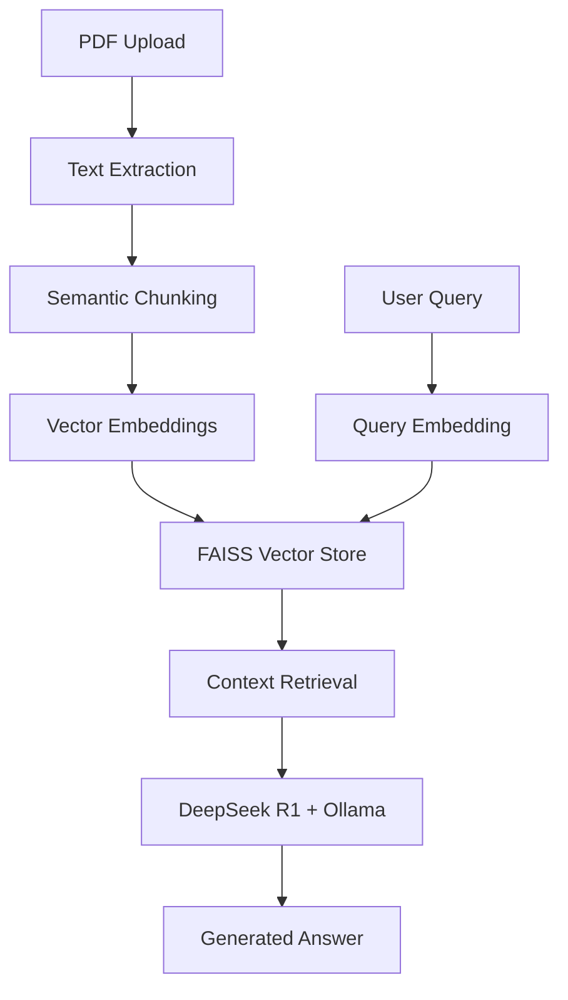

# 📄 DeepseekOllamaRag

> A powerful Retrieval Augmented Generation (RAG) system that enables intelligent document question-answering using DeepSeek R1 and Ollama for completely local, privacy-focused AI inference.

[](https://opensource.org/licenses/MIT)
[](https://www.python.org/downloads/)
[](https://streamlit.io)

## 🚀 Quick Start

### Prerequisites
- Python 3.8 or higher
- [Ollama](https://ollama.ai/) installed and running
- DeepSeek R1 model downloaded via Ollama

### Installation

1. **Clone the repository**
   ```bash
   git clone https://github.com/danieleschmidt/DeepseekOllamaRag.git
   cd DeepseekOllamaRag
   ```

2. **Install dependencies**
   ```bash
   pip install -r requirements.txt
   ```

3. **Setup Ollama and DeepSeek R1**
   ```bash
   # Install Ollama (if not already installed)
   curl -fsSL https://ollama.ai/install.sh | sh
   
   # Pull the DeepSeek R1 model
   ollama pull deepseek-r1:1.5b
   ```

4. **Run the application**
   ```bash
   streamlit run app.py
   ```

5. **Open your browser** to `http://localhost:8501`

## 🎯 Features

### Core Capabilities
- **📋 PDF Document Processing**: Upload and process PDF documents with robust text extraction
- **🔍 Intelligent Chunking**: Semantic text splitting for optimal context preservation
- **🧠 Local AI Inference**: Complete privacy with local DeepSeek R1 model via Ollama
- **⚡ Fast Vector Search**: FAISS-powered similarity search for relevant context retrieval
- **💬 Interactive Q&A**: Natural language question-answering based on document content

### Technical Features
- **🔒 Privacy-First**: All processing happens locally, no data leaves your machine
- **🎨 Modern UI**: Clean, responsive Streamlit interface with custom styling
- **⚡ Performance Optimized**: Efficient document processing and retrieval pipeline
- **📊 Contextual Responses**: Includes source document references in answers

## 🏗️ Architecture Overview



### Technology Stack
- **Frontend**: Streamlit with custom CSS styling
- **Document Processing**: PDFPlumber, LangChain
- **Embeddings**: HuggingFace Transformers
- **Vector Database**: FAISS
- **Language Model**: DeepSeek R1 via Ollama
- **Orchestration**: LangChain

## 📋 Usage

1. **Upload Document**: Click "Upload your PDF file here" and select your PDF
2. **Wait for Processing**: The system will extract text, create embeddings, and setup the retriever
3. **Ask Questions**: Type any question related to the document content
4. **Get Answers**: Receive contextual answers with source references

### Example Queries
- "What are the main conclusions of this research?"
- "Summarize the methodology used in this study"
- "What are the key findings mentioned in section 3?"
- "Who are the authors and what are their affiliations?"

## 🔧 Configuration

### Model Configuration
The application uses DeepSeek R1:1.5b by default. To use a different model:

```python
# In app.py, modify line 117:
llm = Ollama(model="your-preferred-model")
```

### Retrieval Settings
Adjust retrieval parameters in the vector store setup:

```python
# Modify line 114 for different retrieval settings:
retriever = vector.as_retriever(
    search_type="similarity",
    search_kwargs={"k": 5}  # Increase for more context
)
```

### UI Customization
The application includes extensive CSS styling. Modify the styling in the `st.markdown()` section to customize appearance.

## 🤝 Contributing

We welcome contributions! Please see our [Contributing Guidelines](CONTRIBUTING.md) for details.

### Development Setup
1. Fork the repository
2. Create a feature branch
3. Make your changes
4. Add tests (when available)
5. Submit a pull request

## 📚 Documentation

- [Architecture Documentation](ARCHITECTURE.md)
- [Project Roadmap](docs/ROADMAP.md)
- [Architecture Decision Records](docs/adr/)

## 🔒 Security

- All processing happens locally on your machine
- No data is transmitted to external services
- Temporary files are used only during processing
- See [SECURITY.md](SECURITY.md) for security policy

## 📝 License

This project is licensed under the MIT License - see the [LICENSE](LICENSE) file for details.

## 🙏 Acknowledgments

- [DeepSeek](https://deepseek.com/) for the powerful R1 language model
- [Ollama](https://ollama.ai/) for local model inference capabilities
- [LangChain](https://langchain.com/) for the RAG framework
- [Streamlit](https://streamlit.io/) for the web application framework

## 📊 Project Status

Current Version: **0.1.0** (Development)

See our [Roadmap](docs/ROADMAP.md) for planned features and development timeline.

---

**⭐ Star this repository if you find it useful!**